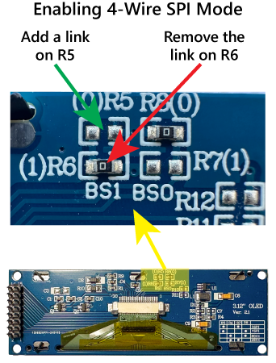

# OLED Display Setup Guide

Complete guide for setting up the SSD1322 256x64 OLED display with Raspberry Pi Zero 2 W.

## Table of Contents

- [Hardware Requirements](#hardware-requirements)
- [Display Preparation](#display-preparation)
- [Wiring](#wiring)
- [Software Installation](#software-installation)
- [Running the Display](#running-the-display)
- [Troubleshooting](#troubleshooting)
- [Auto-Start on Boot](#auto-start-on-boot)

## Hardware Requirements

### Required Components

- Raspberry Pi Zero 2 W (or any Raspberry Pi with GPIO pins)
  - microSD card (8GB+ recommended)
  - Power supply (5V, 2.5A recommended)
  - Raspberry Pi OS installed

- SSD1322 OLED Display
  - 256x64 resolution
  - Grayscale (16-level)
  - SPI interface support

- Wiring
  - Female-to-female jumper wires (7 wires needed)
  - Or soldered connection (more reliable for permanent installations)

### Optional Tools

- Soldering iron and solder (for display modification and permanent connections)
- Multimeter (for testing connections)
- Desoldering pump or wick (for display modification)

## Display Preparation

The SSD1322 display must be configured for 4-Wire SPI Mode before use.

### Why This Is Needed

Most SSD1322 modules ship in parallel/I²C mode by default. We need SPI mode for compatibility with the Raspberry Pi and the `luma.oled` library.

### Modification Steps

This requires some basic soldering skills.



Steps:

1. Locate resistors R5 and R6 on the back of the display module
   - R6 is usually bridged (has solder across it)
   - R5 is usually open (no connection)

2. Desolder R6
   - Use a soldering iron and desoldering pump/wick
   - Remove all solder from R6 pads
   - Ensure the pads are completely separated

3. Bridge R5
   - Apply solder to bridge the R5 pads
   - Ensure a good electrical connection
   - Don't use too much solder - a small bridge is sufficient

4. Verify
   - Use a multimeter to check:
     - R5: Should show continuity (< 1Ω resistance)
     - R6: Should show no continuity (open circuit)

> [!WARNING]
> This modification is permanent. Double-check your display's datasheet before proceeding, as some modules may have different configurations.

## Wiring

### Pin Connections

For complete wiring diagrams and step-by-step instructions, see the [Wiring Guide](wiring.md).

Quick Reference:

| SSD1322 Pin | Raspberry Pi Pin | GPIO      | Function       |
|-------------|------------------|-----------|----------------|
| VCC         | Pin 17           | 3.3V      | Power          |
| GND         | Pin 6            | GND       | Ground         |
| DIN (MOSI)  | Pin 19           | GPIO 10   | Data In        |
| CLK (SCK)   | Pin 23           | GPIO 11   | Clock          |
| CS          | Pin 24           | GPIO 8    | Chip Select    |
| DC (A0)     | Pin 18           | GPIO 24   | Data/Command   |
| RST (RES)   | Pin 22           | GPIO 25   | Reset          |

### Safety Notes

- Always power off the Raspberry Pi before connecting or disconnecting wires
- Verify voltage requirements (most SSD1322 modules use 3.3V)
- Double-check all connections before powering on

## Software Installation

### Step 1: Enable SPI Interface

SPI must be enabled on your Raspberry Pi.

Option A: Using raspi-config (recommended)

```bash
sudo raspi-config
```

Navigate to:

1. Interface Options
2. SPI
3. Select Yes to enable

Option B: Command line

```bash
sudo raspi-config nonint do_spi 0
```

Reboot:

```bash
sudo reboot
```

### Step 2: Verify SPI is Enabled

After rebooting, verify SPI is available:

```bash
ls -l /dev/spidev*
```

Expected output:

```bash
/dev/spidev0.0
/dev/spidev0.1
```

If you don't see these files, SPI is not enabled. Repeat Step 1.

### Step 3: Install Python Dependencies

```bash
# Navigate to project directory
cd ~/departure-board

# Create virtual environment
python3 -m venv oled-env

# Activate virtual environment
source oled-env/bin/activate

# Install required packages
pip install requests Pillow luma.oled luma.core smbus2
```

Package Descriptions:

- `requests` - HTTP library for API calls to Entur
- `Pillow` - Image processing library for rendering graphics
- `luma.oled` - OLED display driver for SSD1322
- `luma.core` - Core library for luma display drivers
- `smbus2` - I²C/SMBus library (required by luma.oled)

### Step 4: Configure Permissions

Add your user to the necessary groups:

```bash
sudo usermod -a -G spi,gpio $USER
```

Log out and back in for group changes to take effect, or use:

```bash
su - $USER
```

## Running the Display

### First Run

```bash
# Activate the virtual environment
source oled-env/bin/activate

# Run the display script
python3 oled.py
```

Expected output:

```
Using real SSD1322 on Raspberry Pi
[Departure data and updates...]
```

### Stopping the Display

Press `Ctrl+C` to stop the script.

## Troubleshooting

### Display Not Working

1. Check SPI is enabled

```bash
lsmod | grep spi
```

Should show `spi_bcm2835` or similar.

2. Verify wiring

- Double-check all 7 connections
- Ensure wires are firmly connected
- Look for loose connections or bent pins

3. Test with verbose logging

The script automatically falls back to emulator mode if hardware fails. Check console output for error messages.

4. Check permissions

```bash
groups
```

Should include `spi` and `gpio` groups. If not, run:

```bash
sudo usermod -a -G spi,gpio $USER
```

Then log out and back in.

### Common Issues

| Problem | Possible Cause | Solution |
|---------|---------------|----------|
| Black screen | No power | Check VCC and GND connections |
| Garbled display | Wrong DC pin | Verify DC pin (GPIO 24, Pin 18) |
| No initialization | Reset pin issue | Check RST pin (GPIO 25, Pin 22) |
| SPI errors | SPI not enabled | Run `sudo raspi-config` and enable SPI |
| Permission denied | User not in groups | Add user to `spi` and `gpio` groups |
| Display flickers | Poor connection | Check all wire connections, consider soldering |

### Script Falls Back to Emulator

If you see:

```
Failed to init real SSD1322, will try emulator: [error message]
```

This means the hardware wasn't detected. Common causes:

- SPI not enabled (see Step 1)
- Incorrect wiring (see [Wiring Guide](wiring.md))
- Wrong GPIO pin numbers in code
- Display not in SPI mode (see [Display Preparation](#display-preparation))

## Auto-Start on Boot

To run the departure board automatically when the Raspberry Pi boots:

### Create Systemd Service

Create the service file:

```bash
sudo nano /etc/systemd/system/departure-board.service
```

Add the following content (adjust paths if needed):

```ini
[Unit]
Description=Departure Board OLED Display
After=network-online.target
Wants=network-online.target

[Service]
Type=simple
User=pi
WorkingDirectory=/home/pi/departure-board
ExecStart=/home/pi/departure-board/oled-env/bin/python3 /home/pi/departure-board/oled.py
Restart=always
RestartSec=10
StandardOutput=journal
StandardError=journal

[Install]
WantedBy=multi-user.target
```

Important: Replace `/home/pi/departure-board` with your actual installation path if different.

### Enable and Start Service

```bash
# Reload systemd to recognize new service
sudo systemctl daemon-reload

# Enable service to start on boot
sudo systemctl enable departure-board

# Start service now
sudo systemctl start departure-board
```

### Managing the Service

```bash
# Check status
sudo systemctl status departure-board

# View logs
sudo journalctl -u departure-board -f

# Stop service
sudo systemctl stop departure-board

# Restart service
sudo systemctl restart departure-board

# Disable auto-start
sudo systemctl disable departure-board
```

## Performance Tips

### Optimize for Raspberry Pi Zero

The Pi Zero has limited resources. To improve performance:

1. Reduce refresh interval in `config/config.json`:
   ```json
   "display": {
     "refreshInterval": 60000
   }
   ```

2. Minimize background processes:
   ```bash
   sudo systemctl disable bluetooth
   sudo systemctl disable avahi-daemon
   ```

3. Use lightweight OS:
   - Consider Raspberry Pi OS Lite (no desktop environment)

### Power Consumption

- The SSD1322 OLED display uses minimal power
- Total power draw: ~500mA typical
- Can be powered from the Pi's 3.3V rail

## Next Steps

- Configure stops: Edit `config/config.json` to add your local transit stops
- Customize appearance: Modify `oled.py` to adjust fonts, layout, or styling
- Web interface: Set up the web version for dashboard integration

## Additional Resources

- [Main README](../readme.md) - Project overview and quick start
- [Wiring Guide](wiring.md) - Detailed pin connections and diagrams
- [Entur API Documentation](https://developer.entur.org/) - Transit data API
- [luma.oled Documentation](https://luma-oled.readthedocs.io/) - Display library
- [Raspberry Pi GPIO Pinout](https://pinout.xyz/) - Interactive pinout reference
- [SSD1322 Datasheet](https://www.newhavendisplay.com/app_notes/SSD1322.pdf) - Display specifications
