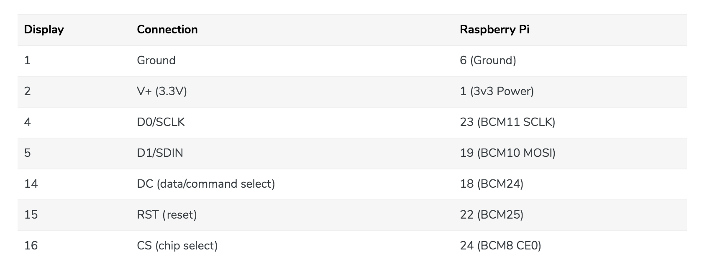
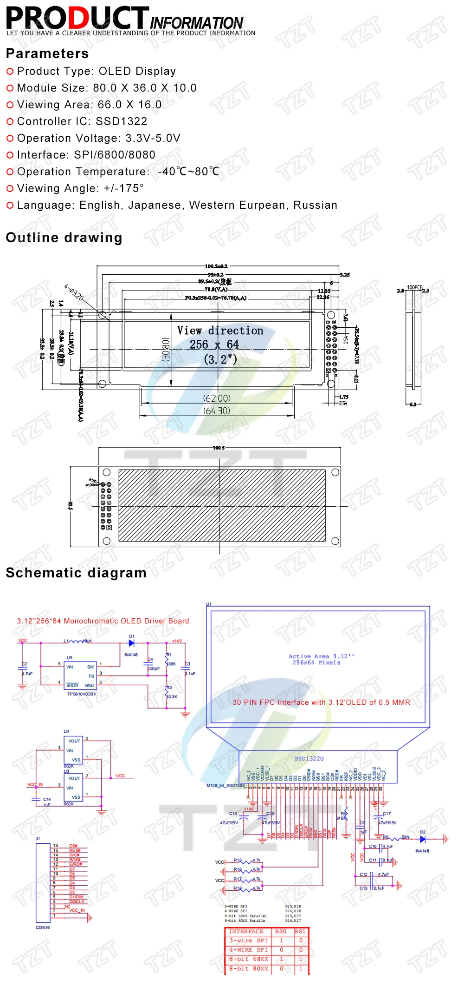

# Wiring Guide: SSD1322 OLED Display to Raspberry Pi Zero 2 W

## Prerequisites

Before wiring, ensure your SSD1322 display is configured for 4-Wire SPI Mode:

- Desolder R6
- Resolder and link to R5

See the [OLED Setup Guide](oled-setup.md#display-preparation) for detailed modification instructions.

## Pin Connections

### SSD1322 to Raspberry Pi GPIO

| SSD1322 Pin | Function     | Raspberry Pi Pin | GPIO Number | Physical Pin                    |
|-------------|--------------|------------------|-------------|---------------------------------|
| VCC         | Power        | 3.3V             | -           | 1 or 17                         |
| GND         | Ground       | GND              | -           | 6, 9, 14, 20, 25, 30, 34, or 39 |
| DIN/MOSI    | Data In      | MOSI             | GPIO 10     | 19                              |
| CLK/SCK     | Clock        | SCLK             | GPIO 11     | 23                              |
| CS          | Chip Select  | CE0              | GPIO 8      | 24                              |
| DC/A0       | Data/Command | GPIO 24          | GPIO 24     | 18                              |
| RST/RES     | Reset        | GPIO 25          | GPIO 25     | 22                              |

### Wiring Diagram



## SSD1322 Schematic



## Step-by-Step Wiring Instructions

1. Power Off - Ensure your Raspberry Pi is completely powered off before connecting any wires

2. Connect Power
   - SSD1322 VCC → Raspberry Pi Pin 17 (3.3V)
   - Note: Some SSD1322 modules support 5V. Check your module's specifications

3. Connect Ground
   - SSD1322 GND → Raspberry Pi Pin 6 (GND)
   - You can use any available GND pin

4. Connect SPI Data Lines
   - SSD1322 DIN/MOSI → Raspberry Pi Pin 19 (GPIO 10)
   - SSD1322 CLK/SCK → Raspberry Pi Pin 23 (GPIO 11)
   - SSD1322 CS → Raspberry Pi Pin 24 (GPIO 8, CE0)

5. Connect Control Lines
   - SSD1322 DC (Data/Command) → Raspberry Pi Pin 18 (GPIO 24)
   - SSD1322 RST (Reset) → Raspberry Pi Pin 22 (GPIO 25)

## Configuration

### Enable SPI Interface

Before running the software, SPI must be enabled on your Raspberry Pi:

```bash
sudo raspi-config
```

Navigate to:

1. Interface Options
2. SPI
3. Select Yes to enable

Alternatively, enable SPI via command line:

```bash
sudo raspi-config nonint do_spi 0
```

Reboot after enabling:

```bash
sudo reboot
```

### Verify SPI is Enabled

After reboot, verify SPI is working:

```bash
ls -l /dev/spidev*
```

You should see:

```text
/dev/spidev0.0
/dev/spidev0.1
```

## Testing

After wiring and enabling SPI:

1. Install dependencies:

   ```bash
   python3 -m venv oled-env && source oled-env/bin/activate
   pip install requests Pillow luma.oled luma.core smbus2
   ```

2. Run the departure board:

   ```bash
   python3 oled.py
   ```

If wired correctly, you should see output indicating the SSD1322 was initialized:

```text
Using real SSD1322 on Raspberry Pi
```

## Troubleshooting

### Display Not Working

1. Check SPI is enabled

   ```bash
   lsmod | grep spi
   ```

   Should show `spi_bcm2835` or similar

2. Verify connections - Double-check all pins are correctly connected

3. Check permissions

   ```bash
   sudo usermod -a -G spi,gpio $USER
   ```

   Log out and back in for group changes to take effect
4. Test with verbose output
   - The script will fall back to emulator mode if hardware fails
   - Check console output for error messages

### Common Issues

- Black screen: Check VCC and GND connections
- Garbled display: Verify DC pin connection (GPIO 24)
- No display initialization: Check RST pin connection (GPIO 25)
- SPI errors: Ensure SPI is enabled and `/dev/spidev0.0` exists

## Safety Notes

- Always power off the Raspberry Pi before connecting/disconnecting wires
- Double-check voltage requirements for your specific SSD1322 module
- Most SSD1322 modules use 3.3V logic, but some support 5V - verify before connecting
- Avoid touching GPIO pins while the Pi is powered on
- Use proper wire gauge (22-26 AWG recommended for breadboard/jumper wires)

## Additional Resources

- [Raspberry Pi GPIO Pinout](https://pinout.xyz/)
- [luma.oled Documentation](https://luma-oled.readthedocs.io/)
- [SSD1322 Datasheet](https://www.newhavendisplay.com/app_notes/SSD1322.pdf)
